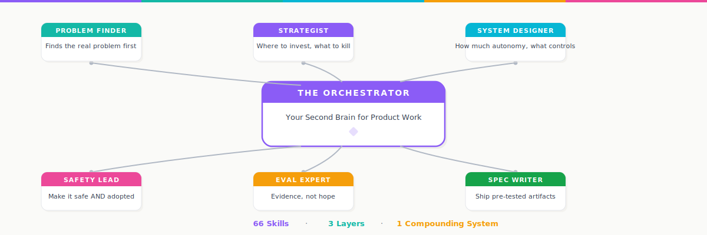
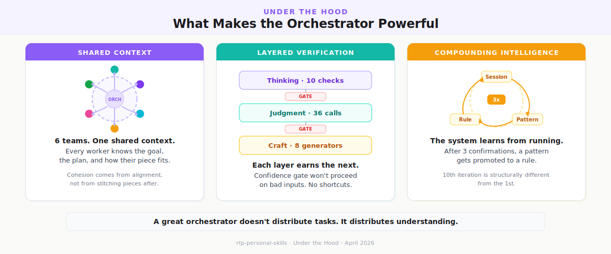
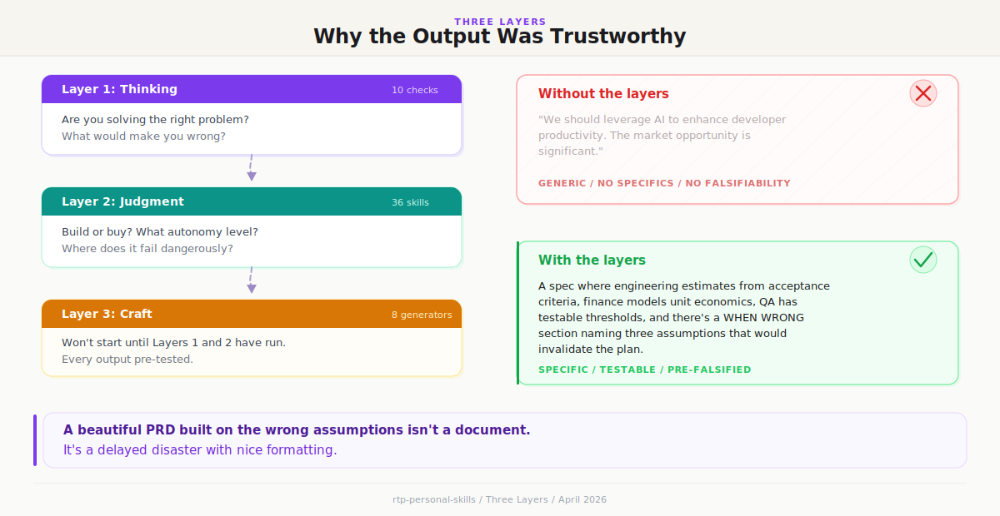
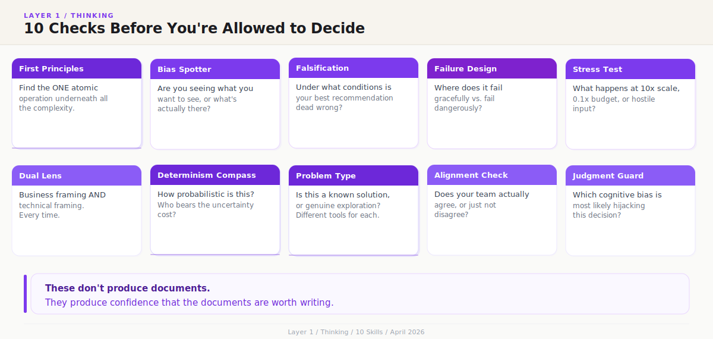
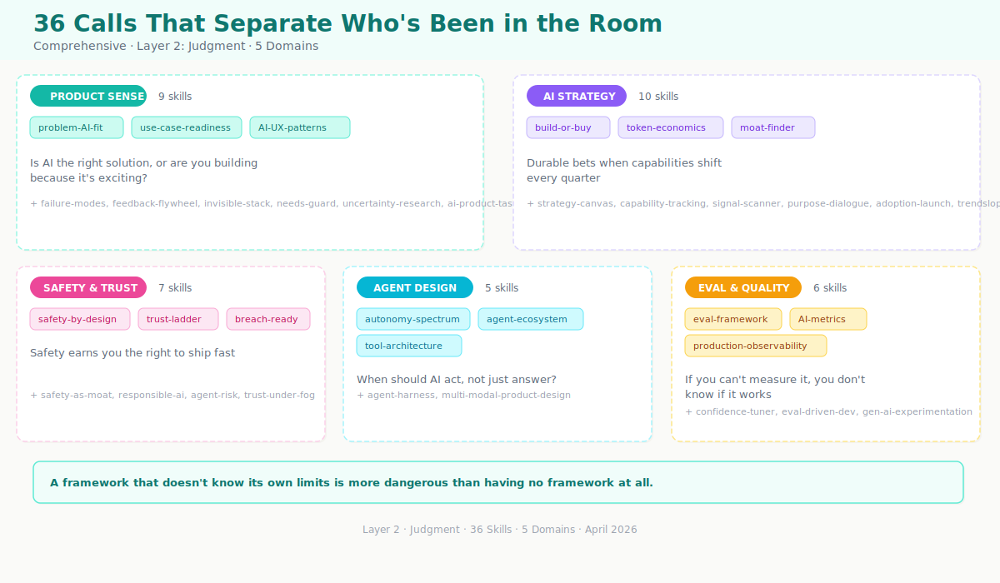
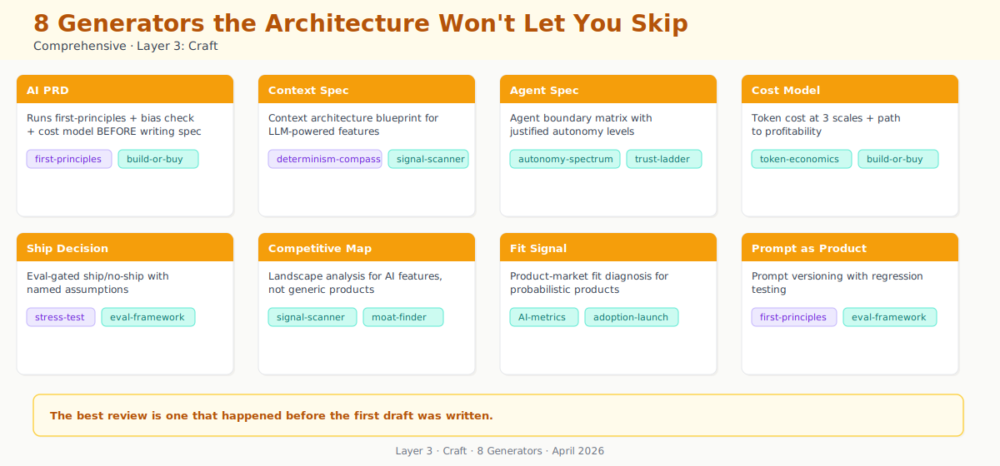

  

---

Everyone has access to Claude. The model is the same for all of us.

What's different is what I've taught mine to do before it speaks.

I spent the past year codifying how I think — the questions I ask before any decision, the traps I've learned to catch, the judgment calls that only come from shipping AI into production — into a system of 66 skills, 6 expert teams, and three layers that check each other's work. Before anyone executes, the orchestrator gives every team the same shared context: the goal, the real constraints, and how each piece connects.

The result isn't faster AI. It's an AI that thinks the way I'd think if I had unlimited time — and then tells me where I might be wrong.

> *"The best product leaders don't have better answers. They have better systems for arriving at answers."*

Last week, a two-sentence enterprise request went in. What came out: a scoped recommendation, three cost models, eval gates, failure modes — and a section explaining when the whole plan is wrong. Nobody asked for that last part.

This is how I actually work. Not a demo. Not a side project. The system I run my professional life on.

---

## See it work

Someone walks in and says:

> *"We want AI in our enterprise app. Can we build an agent that gives users faster insights?"*

The kind of ask that sinks most teams — broad enough to mean anything, specific enough to feel like a plan. Most PMs would start building. The orchestrator starts by figuring out what's actually being asked.

  

What comes out: a scoped recommendation with autonomy levels justified, cost model at three scales, eval gates defined, failure modes mapped — and a section called WHEN WRONG that names the exact assumptions that would invalidate everything. Written before anyone asked for it.

> *"The gap between a junior PM and a senior one isn't knowledge. It's knowing which question to ask before the room realizes it needs asking."*

---

## How it works

  

**Shared context first.** Before any team executes, the orchestrator reads the problem, spots the structural constraint nobody mentioned, and builds a shared understanding. Every worker knows the goal, the plan, and how their piece connects. That's what makes the output cohesive — not assembly after the fact, but alignment before the work begins.

**Three layers, in order.** Thinking surfaces the hard questions. Judgment makes the hard calls. Craft ships the artifacts. Each earns the right for the next to run. Skip one and you get polished work built on unexamined assumptions.

**Gates between layers.** If thinking hasn't cleared its threshold, judgment doesn't fire. The system won't proceed on bad inputs. No shortcuts. No hoping.

**Every session compounds.** Patterns get watched. After three confirmations, promoted to rules. The system doesn't just run — it learns from running.

> *"A great orchestrator doesn't distribute tasks. It distributes understanding."*

---

## The three layers

  

### Thinking — 10 checks

  

In the enterprise AI request, most people hear "faster insights" and start building a dashboard. The thinking layer caught something different: that phrase could mean a retrieval system, an analytics copilot, or a decision-support agent — three architecturally different products with different cost, risk, and adoption profiles. It surfaced which one matched the real constraints before anyone built the wrong one.

That's what 10 thinking checks do. They don't produce documents. They produce **confidence that the documents are worth writing.** The layer has a confidence gate — if inputs don't clear the threshold, it tells you what's missing instead of charging ahead with bad assumptions. You never see "running bias check." You see a recommendation that already accounts for the blind spots.

> *"A beautiful PRD built on the wrong assumptions isn't a document. It's a delayed disaster with nice formatting."*

### Judgment — 36 skills across 5 domains

  

The thinking layer identified that the enterprise request was really about a decision-support agent. Now judgment makes the call. 36 skills weighed safety requirements, latency constraints, cost curves, and adoption readiness — and recommended Level 3 autonomy with human-in-the-loop at decision boundaries. Not a gut feel. A judgment backed by cost models at three scales and a safety analysis mapping the exact scenarios where the system should refuse to act.

Every skill has a WHEN WRONG section — the conditions under which its own advice fails. The enterprise recommendation shipped with three named assumptions that would invalidate the entire plan. That section existed because the skills that wrote it are built to question themselves.

> *"Confidence without a kill condition isn't conviction. It's negligence."*

### Craft — 8 generators

  

Ship-ready artifacts. But none start by asking "what do you need?" They already know — they import everything thinking and judgment discovered. For the enterprise request, craft produced the scoped recommendation, the cost models, and the eval gates. And that WHEN WRONG section nobody asked for? Craft turned the three riskiest assumptions into named conditions with kill switches. The output arrived pre-tested — not because someone bolted on a review step, but because the architecture won't let you skip one.

> *"The best review is one that happened before the first draft was written."*

---

## This runs my whole professional life

  

The same brain that deploys expert teams for AI product work also runs my email, presentations, research, interview prep, and a 17-module AI PM curriculum I'm building. One system. One quality bar. One compounding loop.

> *"Most people use AI to do things faster. A few use it to think things they couldn't think before."*

---

## The belief behind this

The same $200/month model everyone has access to can produce extraordinary results — when you teach it your own judgment first.

The model is identical. The difference is what you've built around it: what to check before acting, what to question before recommending, what to name as wrong before shipping. That WHEN WRONG section from the enterprise request — the one nobody asked for? That's what product thinking sounds like when it's been taught to a machine. That's not prompt engineering. That's something deeper.

> *"Your AI is only as good as the thinking you've taught it to do before it speaks."*

I didn't build this as a portfolio piece. I built it because I needed it. And it turned out to be the clearest proof I know of what happens when a PM treats their own AI with the same rigor they'd bring to any production system.

---

## About me

I'm **Ravi Teja Palanki** — Senior Technical PM at Honeywell, Perplexity AI Fellow 2025.

12 years shipping enterprise products at Fortune 100 scale — industrial, life sciences, energy. 0-to-1 builds through global adoption. Cross-functional teams of 30+. Products from first alpha to $100M+ revenue.

More recently: Gen AI in production. RAG pipelines, LLM-powered assistants for plant managers and field supervisors, context-engineered architectures where a hallucination isn't an inconvenience — it's a compliance incident.

I sit in the room with engineers debating inference latency *and* in the room with executives asking what this means for next quarter. These skills reflect that dual fluency.

> *"The rarest skill in AI product management isn't technical depth or business acumen. It's the ability to hold both in the same sentence."*

---

## License

This repository is **not open source.** The code, skills, frameworks, and architecture are proprietary. You're welcome to be inspired by the approach — codifying your own judgment into your own AI system — but the implementation is mine.

If you'd like to discuss the ideas behind it, I'm always open to conversation.

---

Built with Claude · April 2026
