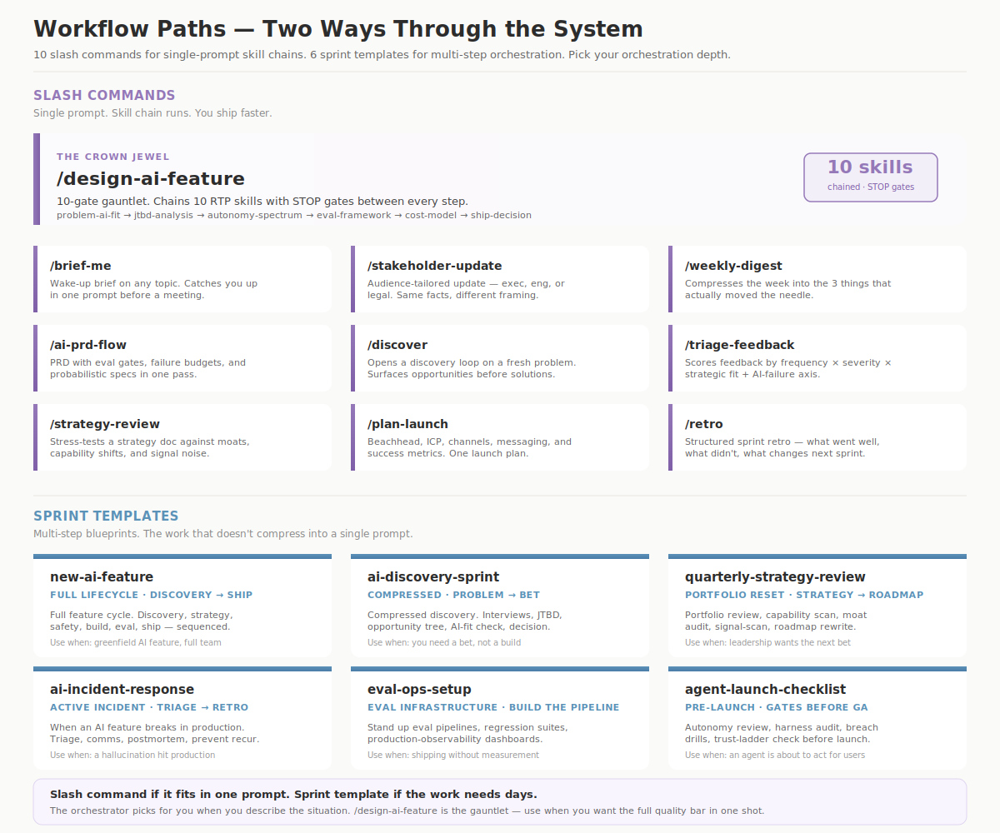

<p align="center">
  
</p>

---

The best product managers I've worked with don't have better answers. They have better questions — and they ask them in the right order.

They check their reasoning *before* they commit to a direction. They name the assumption that would kill the plan *before* the plan gets funded. They know exactly when AI is the wrong solution — and they say it out loud, in the room, when everyone else is nodding along.

After 12 years of shipping enterprise B2B products at Fortune 100 scale — from 0-to-1 builds to global adoption across industrial, life sciences, and energy verticals — I wanted to build a system that thinks like that.

---

## What this is

This is a personal operating system for AI product management, built on [Claude](https://claude.ai). It's how I think — encoded into **66 composable skills** that check each other's work, catch each other's blind spots, and build on each other's output.

It started with a frustration. I'd been shipping Gen AI products — RAG systems, LLM-powered applications, context-engineered architectures — and I kept seeing the same failure pattern. Teams would ship AI features that solved the wrong problem beautifully. The PRD was polished. The architecture was clean. But nobody had stopped to ask: *under what conditions does this advice completely fall apart?* Nobody had run the reasoning through a bias check. Nobody had modeled what happens when the system fails gracefully versus when it fails silently.

So I started writing skills — not templates, not checklists — but ***ways of thinking*** that force the hard questions before any document gets written.

The skill that asks *"what's the one atomic operation underneath all this complexity?"* runs before the skill that writes the PRD. The skill that asks *"who pays the cost if you're wrong?"* runs before the skill that recommends shipping. The skill that maps *where your system breaks down gracefully versus where it breaks down dangerously* runs before anything gets near production.

That's the architecture. **Three layers — reasoning, judgment, craft** — where each layer earns the right to exist by making the next layer's output trustworthy.

---

## The three layers

<p align="center">
  
</p>

**Layer 1 — Thinking** (10 skills) — These don't produce documents. They produce *checks.* Before any decision gets made, these ask: Are you decomposing this from first principles, or just pattern-matching from your last project? Are you seeing what you want to see? If you're wrong, who gets hurt? What would make your strongest recommendation *completely invalid?*

<p align="center">
  
</p>

**Layer 2 — Judgment** (36 skills across 5 domains) — The calls that separate a PM who's been in the room from one who's read about the room. Not "what is retrieval-augmented generation" but *"when is RAG the wrong architecture for your latency and trust constraints, and what do you do instead?"* Not "consider safety" but *"map the exact failure mode where your system's confidence score is high and its answer is dangerous — then design the intervention."*

<p align="center">
  
</p>

**Layer 3 — Craft** (8 generators) — These produce ship-ready artifacts. But none of them start by asking requirements. They start by importing the thinking and judgment layers. The PRD skill runs first principles, bias detection, build-or-buy analysis, and token economics *before* it writes a single line of spec. The output arrives pre-tested — not because I bolted on a review step, but because the architecture won't let you skip one.

<p align="center">
  
</p>

---

## The orchestrator — a second brain, not a routing table

<p align="center">
  
</p>

The orchestrator isn't a skill. It's the brain that deploys all other skills.

Think of it as Jarvis. It carries the full context of who I am — the Bridger archetype, the quality bar, the thinking algorithms — and it runs on every input, silently. When a problem arrives, the orchestrator classifies it (quick answer, deep thinking, or direct action), activates the right thinking algorithms, and deploys **worker agents** to execute.

The orchestrator never does the specialized work itself. It understands the problem, plans the approach, deploys the right workers, reviews their output against the quality bar, and synthesizes the final result. The user sees decisive, executive-level output. The machinery is invisible.

---

## Worker agents — the orchestrator's army

Worker agents are the specialized thinkers the orchestrator deploys. They're not order takers — they're intelligent sub-agents that combine skills with contextual understanding of my persona, goals, and quality bar.

Every worker agent has three components:

1. **Specialized skill(s)** — Domain expertise. A Resume Writer carries resume-building skill. An Article Writer carries research synthesis + writing skill.
2. **Voice and persona** — Every worker inherits the 10 thinking algorithms and the Bridger identity. A resume without the Bridger voice isn't my resume. An article without the thinking algorithms isn't my thought leadership.
3. **Domain memory** — Workers carry knowledge from prior executions. Each time the orchestrator deploys a worker and I provide feedback, that feedback sharpens the worker's future output through skill learning logs and the knowledge base.

**How workers compound:** The orchestrator deploys a worker → the worker executes → the orchestrator reviews against the quality bar → I provide feedback → the feedback is captured in learning logs and rules → the next deployment starts from a higher baseline. A worker that has executed ten resume iterations is structurally different from one on its first run.

**Parallel execution:** When subtasks are independent, the orchestrator runs workers simultaneously. A competitive analysis request might deploy the Research Analyst first, then in parallel: the Article Writer drafts narrative while the Presentation Builder structures the deck. The orchestrator decides parallelism based on dependency analysis — never serializing what can run concurrently.

### The worker agent map

**Cross-Domain (Always Active):**
- **Ravi Voice** — The DNA in every worker. 10 thinking algorithms, 24 anti-patterns, the Bridger identity.

**AI PM Domain** (54 skills, 6 expert agent teams):
- **Sense-Maker** — First principles, problem-AI-fit, use-case readiness. Understands the real problem before anyone solves it.
- **Strategist** — Strategy canvas, moat-finder, build-or-buy, token economics, signal scanner. Where to invest, what to kill.
- **Architect** — Autonomy spectrum, agent ecosystem, tool architecture. How much autonomy, what architecture, what controls.
- **Trust Builder** — Safety-by-design, trust ladder, judgment guard, breach-ready. Make it safe AND get people to use it.
- **Prover** — Eval framework, AI metrics, production observability. Prove it works with evidence, not hope.
- **Crafter** — AI PRD, context spec, agent spec, cost model, ship decision. Produce pre-tested documents.

**Writing & Communication:** Email Writer, Article Writer
**Research:** Research Analyst (Grok + Perplexity + HBR pipelines)
**Presentation & Visual:** Presentation Builder (zero-dependency HTML), Diagram Builder (Excalidraw SVGs)
**Career & Interview:** Interview Strategist
**Course Building:** Curriculum Architect

New workers emerge dynamically as the work evolves. The orchestrator creates them by pairing specialized skills with the Ravi Voice and connecting them to relevant project context.

---

## Why it's layered this way

**Without the layers:**

> *"We should leverage AI to enhance developer productivity. The market opportunity is significant."*

**With the layers:**

> *A spec where engineering can estimate directly from the acceptance criteria, finance can model the unit economics from the cost analysis, QA has testable thresholds for every failure mode, and there's a section called* ***WHEN WRONG*** *that tells you exactly which three assumptions would invalidate the entire plan — written before anyone asked for it.*

The difference isn't polish. **It's that the thinking happened in the right order.**

---

## The five judgment domains

**Product Sense** — Is AI the right solution, or are you building because the technology is exciting? Nine skills that separate signal from hype in your own product instincts.

**AI Strategy** — How do you make durable bets when the capabilities shift every quarter? Ten skills for the kind of strategic thinking that doesn't expire in six months.

**Safety & Trust** — Not compliance theater. Seven skills that treat safety as the thing that earns you the right to ship fast — because teams that think about failure modes upfront move faster than teams that discover them in production.

**Agent Design** — When should AI act, not just answer? Five skills for the product decisions that emerge when your system has autonomy.

**Eval & Quality** — If you can't measure it, you don't know if it works. Six skills that make "how do we know this is good?" a first-class product question, not an afterthought.

Every skill includes a WHEN WRONG section — the conditions under which its own advice fails. A framework that doesn't know its limits is more dangerous than having no framework at all.

---

## General-purpose skills

Beyond the 54 AI PM skills, the system includes 12 skills for the rest of the workday — email composition with voice calibration, zero-dependency HTML presentations, hand-drawn SVG diagrams, research synthesis pipelines, a full brand design system, and the administrative tooling that keeps the whole structure healthy.

---

## The compounding system

> *This is the part that took the most iteration — and it's the part that makes everything else work.*

<p align="center">
  
</p>

Every skill follows a **shared protocol** — gather context → choose depth → build a trade-off ledger → pass a quality gate → generate the deliverable. This means skills compose. The output of one becomes the input of the next, without translation loss.

Every diagnostic question includes **calibrated answer nudges** — ranges from low-confidence to red-flag — so the system adjusts its depth to match how well-defined the problem actually is. Vague input doesn't get glossed over. It gets flagged.

<p align="center">
  
</p>

And every session feeds back. Patterns get watched. After three confirmations, they get promoted to rules. The rules shape future sessions. **The system doesn't just run — it learns from running.**

---

## About me

I'm **Ravi Teja Palanki** — Senior Technical PM at Honeywell, Perplexity AI Fellow 2025.

I've spent 12+ years shipping enterprise B2B products at Fortune 100 scale — from 0-to-1 builds through global adoption across industrial, life sciences, and energy verticals. I've led cross-functional teams of 30+ and taken products from first alpha to $100M+ revenue opportunity. More recently, I've shipped Gen AI into production: RAG pipelines, LLM-powered assistants for plant managers and field supervisors, context-engineered architectures designed for safety-critical industrial environments where a hallucination isn't an inconvenience — it's a compliance incident.

That range is what shaped this system. I sit in the room with engineers debating inference latency and retrieval accuracy *and* in the room with executives asking what this means for next quarter's roadmap. The skills reflect that dual fluency — technical depth that engineers respect, strategic clarity that executives can act on.

I'm what the research calls a *bridger.* When engineering says "we need a validation layer," design says "users need to feel in control," and the business asks "what's the ROI at 10x scale" — I make each feel understood and challenged, then synthesize the path that serves all three. That instinct — translating across contexts, integrating across incentives — is the design principle behind every skill in this system.

This isn't a side project. It's how I actually work. And it's the clearest demonstration I know of what happens when a PM treats their own AI tooling with the same rigor they'd bring to any production system they're responsible for.

---

## Installation

```bash
# As a Claude plugin:
claude plugin install raviteja-palanki/rtp-personal-skills

# Or clone directly:
git clone https://github.com/raviteja-palanki/rtp-personal-skills.git
```

---

<sub>Built with Claude · April 2026 · All rights reserved</sub>
