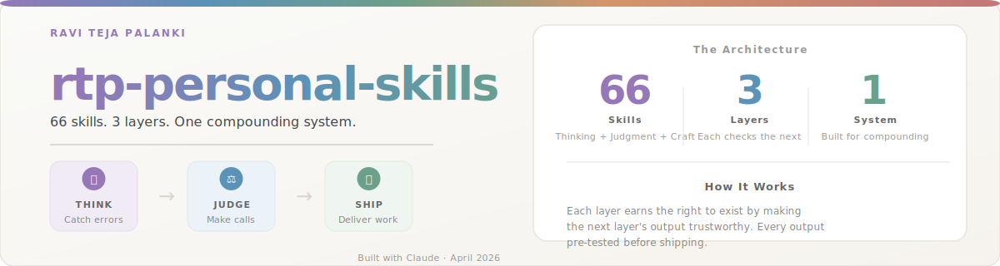
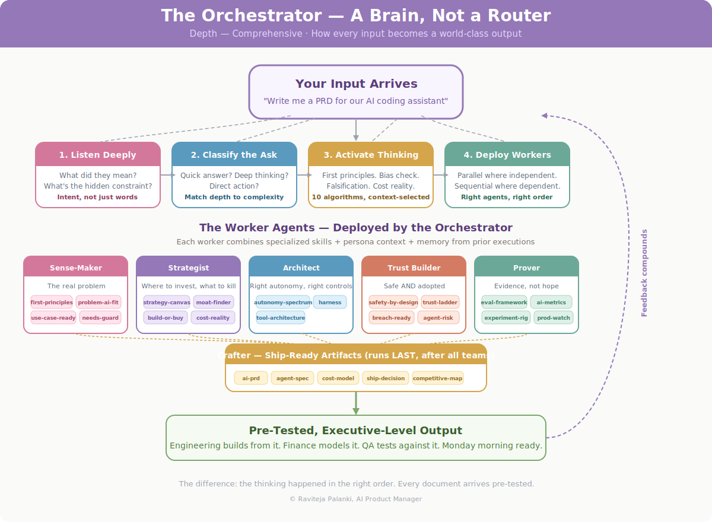
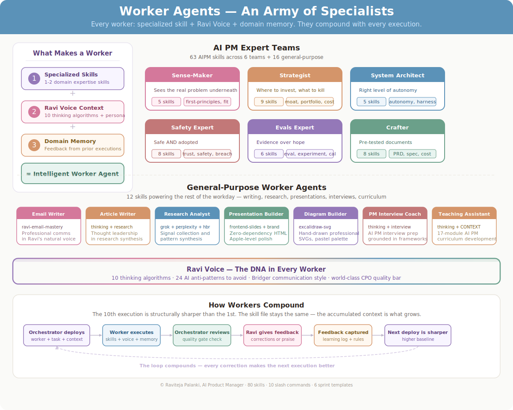
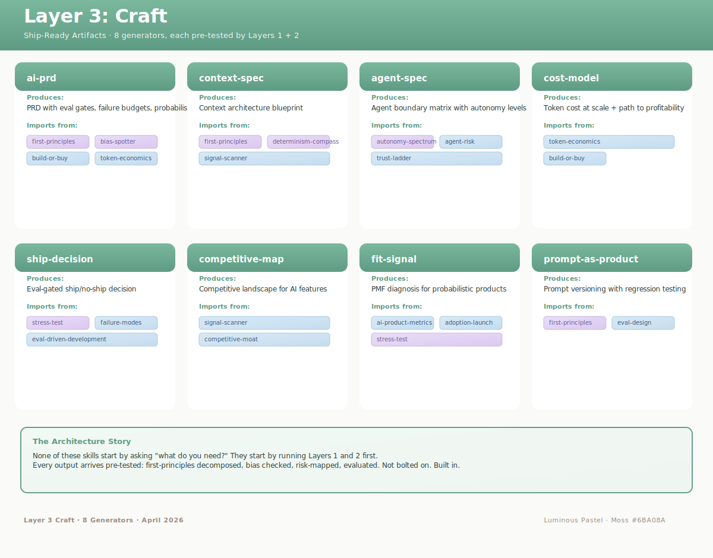
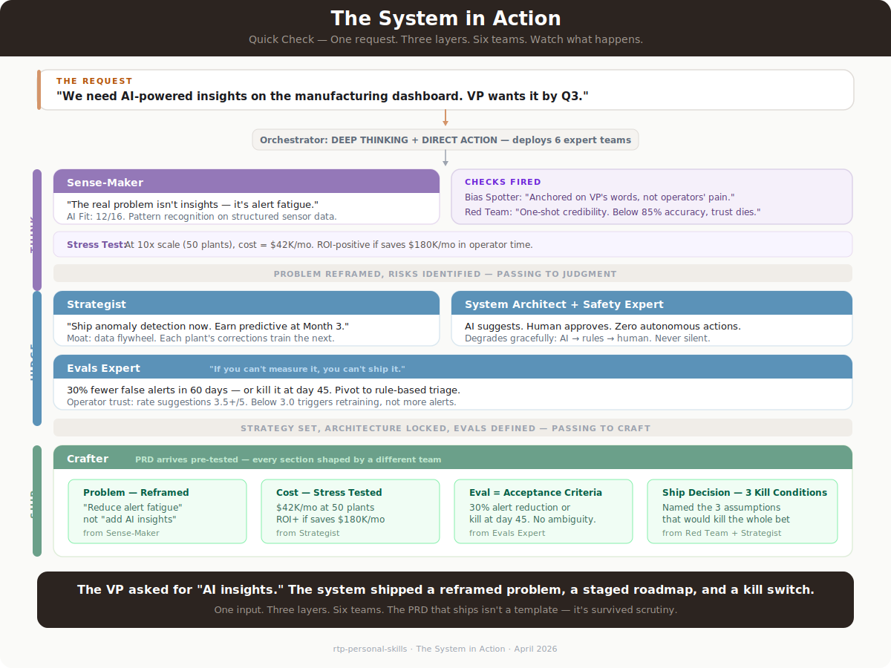
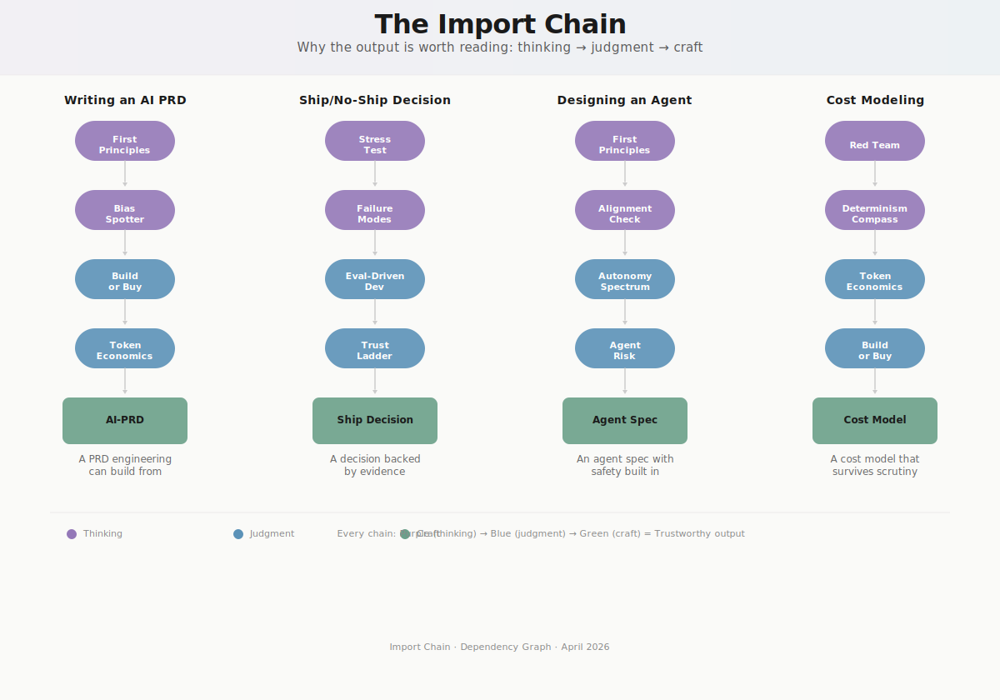

<p align="center">
  
</p>

---

I didn't build 80 skills. I built a brain.

The skills are its expertise. The orchestrator is its judgment. The slash commands are how it executes a single decisive thought across a chain of expert agents. And the whole thing learns — every session, every correction, every hard question — it compounds.

This is what happens when a product manager treats their own AI tooling with the same rigor they'd bring to any production system they're responsible for.

---

## The idea, in one sentence

**An AI operating system that thinks before it acts, deploys specialized agents to do the work, reviews their output, commands the entire installed plugin ecosystem (not just its own skills), and gets sharper every time it runs.**

Most people use AI like a calculator — type a question, get an answer, move on. Nothing connects. Nothing compounds. Every conversation starts from zero.

This is built differently. It's a chief of staff who knows your projects, understands your thinking style, remembers what worked last time, and — when you say *"write me a PRD"* — doesn't just fill in a template. It checks your reasoning. It asks whether you've considered the failure modes. It models the cost at 10x scale. It flags the assumption that would kill the plan. Then it writes the PRD — and the PRD arrives pre-tested, because the thinking happened in the right order.

Four parts make it work.

---

## Install (any machine)

**Step 1 — Install this plugin:**

```
/plugin marketplace add github:raviteja-palanki/rtp-personal-skills
/plugin install rtp-personal-skills@rtp-personal-skills
```

Restart Claude Code. Every skill becomes addressable as `rtp-personal-skills:rtp-{name}` (e.g., `rtp-personal-skills:rtp-design-ai-feature`). Slash commands like `/design-ai-feature`, `/stakeholder-update`, `/brief-me`, and `/rtp-setup` work directly.

**Step 2 — Bootstrap the companion ecosystem:**

```
/rtp-setup
```

This prints the full install sequence for companion plugins (`superpowers`, `compound-engineering`, `pm-skills`, `anthropic-skills`, `github/linear/supabase`) so the orchestrator can command the entire Claude Code plugin ecosystem — not just RTP's own skills. Full tier map in [COMPANION-PLUGINS.md](COMPANION-PLUGINS.md). Machine-readable manifest in [companion-plugins.json](companion-plugins.json).

Without companion plugins the orchestrator still works — it falls back to RTP-only mode covering AI PM strategy, content, design, and governance end to end. With them, it commands the wider ecosystem (TDD discipline, textbook PM frameworks, real .pptx/.docx file generation, dev tools).

---

## Part 1: The Orchestrator — A Brain, Not a Router

<p align="center">
  
</p>

Most AI systems route. You say "write a PRD," it loads a PRD template. There's no judgment, no context, no memory of who you are or what you're trying to accomplish.

The orchestrator is different. It's the persistent brain at the center of everything.

**On every input it does five things — silently, before you see any output:**

1. **Listens deeply.** Not just what you asked, but what you meant. It reads the hidden signals — your role, your constraints, the phase of work you're in, the structural problem you haven't mentioned yet.
2. **Classifies the ask.** Quick answer, deep thinking, or direct action? A factual question gets answered in two sentences, not a five-step analysis. Respect for your time is a design principle.
3. **Activates the right thinking patterns.** Ten cognitive algorithms — first principles, red-teaming, bias detection, production reality checks, graceful degradation — run on every input. Not all ten every time. The ones that matter for *this* problem.
4. **Deploys worker agents.** Independent tasks run in parallel. Dependent tasks run in sequence. The orchestrator manages the handoffs.
5. **Reviews and synthesizes.** Workers produce drafts. The orchestrator reviews for quality, consistency, and blind spots. The user sees one synthesized output — executive-level on the surface, PhD-level underneath.

**Communication rules are non-negotiable:**
- Every recommendation is decisive. *Do X* — not *consider X*.
- Every recommendation has conditions. *This works IF [condition]. If [condition] changes, pivot to [alternative].*
- Every output ends with what to do Monday morning. Not what to think about — what to **DO**.

---

## Part 2: Full Ecosystem Awareness — The 0.1% Move

The orchestrator commands the entire installed Claude Code plugin ecosystem, not just the skills in this repo. RTP skills are first preference when a purpose-built equivalent exists. But the orchestrator never refuses a task because RTP doesn't ship a skill for it. When a non-RTP plugin solves the problem better, it reaches for it.

Five tiers, each with a clear use:

**Tier 1 — RTP skills (Ravi's voice + thinking).** AI PM strategy, content or visual output that must sound like Ravi, governance, design system work. The 63 AI PM skills + 17 general-purpose skills in this repo.

**Tier 2 — Process and engineering rigor.** `superpowers:*` and `compound-engineering:*` for TDD discipline, systematic debugging, code review (giving and receiving), brainstorming, frontend design, agent-native architecture, dhh-rails-style. When the work is actual engineering — code, tests, debug — these own the discipline layer.

**Tier 3 — PM execution (pm-skills marketplace, 8 plugins).** Lean Canvas, OKRs, RICE, JTBD, Porter's Five Forces, GTM motions, cohort analysis, A/B test stats. Textbook PM frameworks for when an AI-specific RTP version doesn't apply.

**Tier 4 — File formats and Anthropic skills.** `anthropic-skills:pdf`, `anthropic-skills:pptx`, `anthropic-skills:xlsx`, `anthropic-skills:docx`, `anthropic-skills:web-artifacts-builder`. Whenever the task touches that file format. Layered with Tier 1 design DNA when the output is visual.

**Tier 5 — Development tools.** `github`, `linear`, `supabase`, `commit-commands`, `episodic-memory:search-conversations`, `elements-of-style`. The orchestrator picks the right tool for the actual need — never reinvents what's wrapped.

The result: **the orchestrator is never narrow.** It picks the right plugin every time, RTP-first when a purpose-built skill exists, falling back where it doesn't.

---

## Part 3: Worker Agents — An Army of Specialists

<p align="center">
  
</p>

Worker agents are not scripts. They're intelligent sub-agents combining specialized skills with contextual understanding.

Every worker has three components: **domain expertise** (one or two specialized skills), **persona context** (they understand the user's voice, thinking style, and quality bar), and **memory** (they carry feedback from prior executions, so the tenth time a worker runs, it's structurally sharper than the first).

### The AI PM Expert Teams (63 skills across 6 teams)

**The Sense-Maker** sees the real problem — not the one you described, but the one underneath. First-principles decomposition, AI-fit scoring, uncertainty mapping, JTBD demand-side analysis, opportunity-solution-tree with feasibility filter, attitudinal segmentation by AI stance.

**The Strategist** decides where to invest and what to kill. Capability-conditional roadmaps with expiration dates. Moat analysis through Helmer's 7 Powers (real moats vs vanity claims). Cost reality at production scale. Vision durable across model generations. Trendslop detector for AI strategy that's just popular advice.

**The System Architect** designs the right level of autonomy. Not *how autonomous CAN we make this* but *what level does each interaction DESERVE?* L1-L6 spectrum. Tool access with consequence-aware permissions. Harness architecture (planner → generator → evaluator) that keeps agents productive and safe.

**The Safety Expert** makes it safe AND gets people to use it. Safety-by-design baked into architecture. Adoption curves modeled by persona. Proportionality analysis for every agent. Breach readiness — designing systems that survive being hacked, not just systems that resist it.

**The Evals Expert** replaces hope with evidence. Open coding → axial coding → selective coding (Husain + Shankar methodology) on AI traces. Confidence calibration that prevents both over-reliance and dismissal. The rule: if you can't measure it, you can't ship it.

**The Crafter** produces the documents that ship the product — PRDs, agent specs, cost models, ship/no-ship decisions, stakeholder updates. Because the Crafter runs *after* the other five teams, every document arrives pre-tested. The PRD has eval criteria as acceptance criteria. The cost model has been stress-tested at 10x. The stakeholder update carries an eval-backed confidence band, a named drift surface, and a mandatory "what could be wrong" section.

### The General-Purpose Agents (16 skills)

Beyond AI PM, specialists for the rest of the workday: email writer, deep dive writer (long-form thought leadership), research analyst (Grok + Perplexity + HBR pipelines), presentation builder (zero-dependency HTML), diagram builder (hand-drawn pastel SVG), UX design agent (58-company pattern catalog), product mentor (Doshi LNO + altitude-horizon), interview coach, teaching assistant (CONTEXT framework), admin agent, resume builder (pixel-perfect ReportLab PDF), and **design-spec** — generator for Google Labs' DESIGN.md format that makes any design system AI-agent-portable in 30 seconds.

Every worker inherits from **Ravi Voice** — the master thinking system carrying 10 cognitive algorithms, 24 AI writing anti-patterns, and the Bridger communication style. Voice is the DNA in every worker.

---

## Part 4: 10 Slash Command Workflows + 6 Multi-Day Sprint Templates

Two distinct kinds of orchestrated work, each in its own folder.

### 10 Slash Commands (single-prompt skill chains)

Run when one decisive output is needed that pulls multiple skills together in one motion.

| Command | What it chains | When to run |
|---|---|---|
| `/brief-me` | memory + recent activity → 60-second briefing | Every morning |
| `/stakeholder-update` | stakeholder-communications + memory + activity | Before sending exec/eng/customer comms |
| `/weekly-digest` | week's CHANGE_LOG + git activity + ACTION-PLAN deltas | Friday afternoons |
| `/design-ai-feature` | **10-gate gauntlet** — problem-ai-fit → first-principles → autonomy-spectrum → determinism-compass → prompt-craft → eval-framework → cost-model → ai-ux-patterns → safety-by-design → ai-prd | Before a single line of code |
| `/ai-prd-flow` | problem-ai-fit + use-case-readiness + jtbd-analysis + ai-prd + ship-decision | When PRD context is established |
| `/discover` | problem-ai-fit + jtbd-analysis + opportunity-solution-tree + uncertainty-research | Single-prompt discovery cycle |
| `/triage-feedback` | feedback-triage (4-axis score) + failure-modes | When inboxes pile up |
| `/strategy-review` | strategy-canvas + moat-finder + competitive-map + cost-model + signal-scanner | Quarterly check |
| `/plan-launch` | adoption-launch + ship-decision + cost-model + breach-ready + production-observability | L4+ AI feature launch |
| `/retro` | original AI-PRD lookup + ai-product-metrics + stress-test + feedback-flywheel | Post-ship reflection |

The crown jewel is `/design-ai-feature` — every gate prevents a specific AI launch failure mode. *problem-ai-fit* prevents building ML for a problem rules would solve at 1/100th the cost. *autonomy-spectrum* prevents giving AI L4 when L2 was sufficient. *cost-model* prevents the 1000x volume blow-up between pilot and GA. *safety-by-design* prevents bolted-on guardrails that break the UX before fixing the failure mode.

### 6 Multi-Day Sprint Templates

Project blueprints, not single prompts. Run when the work spans days and orchestrates 30+ skills end-to-end.

| File | Timeline | Purpose |
|---|---|---|
| `new-ai-feature.md` | 12 days | Concept → launch full cycle, all 80 skills |
| `ai-discovery-sprint.md` | 5 days | Validate problem-solution fit + map failure landscape |
| `quarterly-strategy-review.md` | 5 days | Capability check, moat erosion, build-or-buy reassessment |
| `ai-incident-response.md` | hours-days | Active AI incident — triage, contain, communicate, retro |
| `eval-ops-setup.md` | days | Stand up an eval pipeline from scratch |
| `agent-launch-checklist.md` | days | Pre-launch readiness for an agentic system |

Slash commands and sprint templates are NOT competing — slash commands are the daily-cadence layer that supports execution between sprint cycles.

---

## Part 5: The Three-Layer Skill Architecture

<p align="center">
  
</p>

The 63 AI PM skills are organized into three layers. Each layer earns the right to exist by making the next layer's output trustworthy.

### Layer 1: Thinking — *Before you decide anything* (10 skills)

These don't produce documents. They produce **checks.**

Before any decision: Are you decomposing from first principles, or pattern-matching from your last project? Are you anchored on what a competitor built instead of what your users need? If your AI system fails, does it degrade gracefully or fail silently? What would make your strongest recommendation completely invalid?

Core thinking skills: first-principles, bias-spotter, falsification, dual-lens, determinism-compass, stress-test, failure-design, alignment-check, judgment-guard, problem-type.

<p align="center">
  
</p>

### Layer 2: Judgment — *The hard calls* (43 skills across 5 domains)

The decisions that separate a PM who's been in the room from one who's read about the room.

**Product Sense** (14 skills) — Is AI the right solution, or are you building because the technology is exciting? Scores AI fit 0-16. Maps invisible stack. Designs the feedback flywheel. Plus the new layer — JTBD demand-side analysis (AI changes the job being hired), opportunity-solution-tree with AI-feasibility filter (deterministic / probabilistic+evals / unevaluable), interview synthesis using the same coding methodology your evals use, feedback triage with an AI-failure axis (bimodal feedback isn't averaged into invisibility), attitudinal segmentation by AI stance (Embracer / Neutral / Skeptic).

**AI Strategy** (11 skills) — Durable bets when capabilities shift every quarter. Capability-conditional roadmaps. Moat analysis through Helmer's 7 Powers. Portfolio with stage gates. Vision durable across model generations (10x better and 10x cost test). Trendslop detector.

**Safety & Trust** (7 skills) — Not compliance theater. Safety as the thing that earns the right to ship fast. Proportionality analysis. Breach readiness. Trust signals calibrated so users neither over-rely nor ignore.

**Agent Design** (5 skills) — When AI should act, not just answer. Autonomy spectrum L0-L6. Multi-agent orchestration. Tool access with consequence-magnitude-aware permissions.

**Eval & Quality** (6 skills) — If you can't measure it, you don't know if it works. Evaluation before code. Open coding → axial coding → selective coding. Confidence tuning that reduced errors by 49% in research.

<p align="center">
  
</p>

### Layer 3: Craft — *Ship-ready artifacts* (10 skills)

PRDs, agent specs, cost models, ship decisions, competitive maps, product-market fit signals, prompt specifications, prompt craft, **stakeholder communications** (the new one — AI-native confidence framing trio: eval-backed band + drift surface + mandatory "what could be wrong" section).

None of them start by asking requirements. They start by importing the thinking and judgment layers. The output arrives pre-tested — not because a review step was bolted on, but because the architecture won't let you skip one.

---

## Watch It Work — A Real Enterprise Request

Architecture diagrams show structure. This shows what the structure *does.*

A VP sends a message: *"We need AI-powered insights on the manufacturing dashboard. Q3 deadline."*

Most PM tools open a PRD template. This system does something different.

<p align="center">
  
</p>

The VP asked for *AI insights.* What shipped was a reframed problem (alert fatigue, not insights), a staged capability roadmap (anomaly detection now, predictive at Month 3), an autonomy decision (Level 2 — AI suggests, human approves), a stress-tested cost model ($42K/mo at 50 plants, ROI-positive if it saves $180K/mo), and a kill switch (< 15% false-alert reduction at day 45 → pivot).

Every section was shaped by a different team. The Sense-Maker reframed the problem. The Strategist built the roadmap with an expiration date. The System Architect and Safety Expert locked the autonomy level and designed the degradation path. The Evals Expert defined success before a line of code was written. The Crafter assembled it all — but the document arrived pre-tested because the thinking happened in the right order.

That's the difference between a template and an operating system.

---

## The Frameworks Embedded

These are not referenced. They're folded into specific skills with attribution and AI-PM extensions.

| Practitioner | Framework | Skill |
|---|---|---|
| **April Dunford** | 5-component positioning + battlecard | `competitive-map` |
| **Hamilton Helmer** | 7 Powers (with real-vs-vanity diagnostics) | `moat-finder` |
| **Shreyas Doshi** | LNO, pre-mortem, altitude-horizon, product work levels | `product-thinking`, `stress-test` |
| **Hamel Husain + Shreya Shankar** | Open coding → axial coding → selective coding | `eval-framework`, `interview-synthesis` |
| **Aparna Chennapragada** | NLX as new UX (5 inversions + 4 patterns) | `ai-ux-patterns` |
| **Bob Moesta** | JTBD demand-side + Switch Interview | `jtbd-analysis`, `uncertainty-research` |
| **Teresa Torres** | OST + AI-feasibility filter | `opportunity-solution-tree` |
| **Lenny Rachitsky** | North Star + AARRR for AI (5-stage funnel) | `ai-product-metrics` |
| **Colin Matthews** | Vibe-coding (PRD → prototype in 10 min) | `prompt-craft` |
| **Hilary Gridley** | AI Embracer / Neutral / Skeptic | `attitudinal-segmentation` |
| **Palle Broe** | AI monetization decision tree (59% bundle / 23% add-on / 18% standalone) | `token-economics` |
| **Marty Cagan / Jackie Bavaro** | Vision durability across model generations | `vision-setting` |
| **Google Labs** | DESIGN.md format spec (W3C / Tailwind / DTCG export) | `design-spec` |

---

## DESIGN.md — Agent-Portable Design System

The `ravi-personal-branding` skill exports as a [Google Labs DESIGN.md](https://github.com/google-labs-code/design.md) file — a single Markdown document with YAML token frontmatter that any coding agent (Claude Code, Cursor, v0, Bolt) can consume to produce consistent UI. Tokens are W3C Design Token Format compatible. Export to Tailwind theme config or DTCG `tokens.json` with a CLI command. A coding agent given this DESIGN.md ships UI in 30 seconds. Given a 50-page Figma file, it gets it wrong half the time.

---

## The Compounding Engine

<p align="center">
  
</p>

This part took the most iteration — and it's the part that makes everything else work.

**Every skill follows a shared protocol:** gather context → choose depth → build a trade-off ledger → pass a quality gate → generate the deliverable. Skills compose. The output of one becomes the input of the next without translation loss.

**Every diagnostic question includes calibrated answer nudges** — thinking dimensions, spectrum anchors, red flag patterns, sharpening probes — so the system adjusts depth to match how well-defined the problem is. Vague input doesn't get glossed over. It gets flagged.

**Every skill has a WHEN WRONG section** — the conditions under which its own advice fails. A framework that doesn't know its limits is more dangerous than no framework at all.

**Every session feeds back.** Patterns get watched. After three confirmations, they become rules. Rules shape future sessions. Anti-patterns get captured when they cause real waste. The orchestrator reads them and avoids repeating them. Over months, the system gets meaningfully sharper.

This isn't a library of tools. It's an operating system that learns.

---

## About me

I'm **Ravi Teja Palanki** — Senior Technical PM at Honeywell, Perplexity AI Fellow 2025.

12+ years shipping enterprise B2B products at Fortune 100 scale. From 0-to-1 builds through global adoption across industrial, life sciences, and energy verticals. Led cross-functional teams of 30+ and taken products from first alpha to $100M+ revenue opportunity. More recently: shipping Gen AI into production — RAG pipelines, LLM-powered assistants for plant managers and field supervisors, context-engineered architectures designed for safety-critical industrial environments where a hallucination isn't an inconvenience, it's a compliance incident.

I'm what the research calls a *bridger.* When engineering says *we need a validation layer*, design says *users need to feel in control*, and the business asks *what's the ROI at 10x scale* — I make each feel understood and challenged, then synthesize the path that serves all three. That instinct — translating across contexts, integrating across incentives — is the design principle behind every skill in this system.

---

## Repo state at a glance

- **80 skills** (62 AIPM layer + 1 orchestrator + 17 general-purpose), all lint-clean and voice-consistent
- **10 slash command workflows** + **6 multi-day sprint templates**
- **1 plugin marketplace registration** (installable from any machine)
- **1 orchestrator** that thinks across the 5-tier ecosystem
- **DESIGN.md export** for the brand system (agent-portable)
- All skills in this repo cross-reference each other; no orphans

License: All Rights Reserved. Use, study, learn from. Don't ship as your own.

---

<sub>Built with Claude · 26 April 2026 · Compound Engineering · v1.1</sub>
