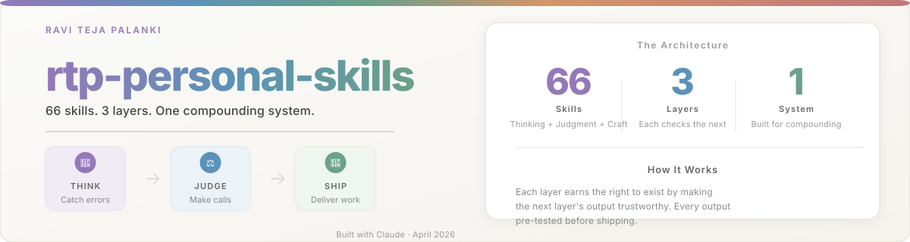

<p align="center">
  
</p>

# rtp-personal-skills

My product judgment, written down and version-controlled. 81 skills that encode how I make AI product decisions — when AI is the right answer, how much autonomy an agent has earned, what a real moat is, what to check before shipping. An orchestrator composes them the way I would.

## Install

```
/plugin marketplace add github:raviteja-palanki/rtp-personal-skills
/plugin install rtp-personal-skills@rtp-personal-skills
```

Restart Claude Code. Every skill works as `rtp-personal-skills:rtp-{name}`. Commands like `/design-ai-feature` and `/brief-me` work directly.

## What's inside

| | | |
|---|---|---|
| **Think** | 24 skills | Is this even an AI problem? What bias makes it feel obvious? What's the user really hiring it for? |
| **Judge** | 29 skills | Autonomy, moats, pricing, safety, evals — the calls that earn the right to ship. |
| **Craft** | 10 skills | AI-PRDs, agent specs, cost models, launch gates — documents that arrive pre-tested. |
| **Plus** | 18 skills | The orchestrator, writing, presentations, design systems, research, admin. |

11 slash commands chain skills into one decision. 6 sprint templates run multi-step work. Full detail: [ARCHITECTURE.md](ARCHITECTURE.md).

## The quality bar

- Every number is tagged by how solid it is: ✅ audited · ◆ company-disclosed · ⚠ reported.
- Every rule states the conditions under which it fails — advice that knows its limits.
- Everything reads in plain language. If a framework term appears, a legend explains it.

## Who I am

**Ravi Teja Palanki** — Senior Technical PM at Honeywell · Perplexity AI Fellow 2025. 12+ years shipping enterprise products at Fortune 100 scale; now shipping Gen AI into production for safety-critical industrial environments.

[ravitejapalanki.com](https://ravitejapalanki.com) · [LinkedIn](https://www.linkedin.com/in/ravipalanki) · ravi.aifluentproduct@gmail.com

---

<sub>License: All Rights Reserved. Use, study, learn from. Don't ship as your own. · Updated July 2026</sub>
