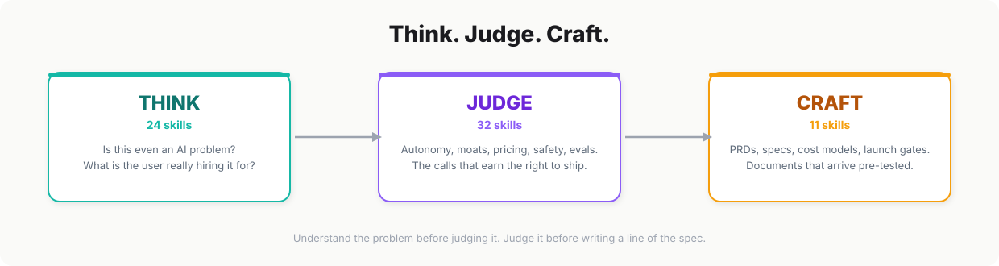
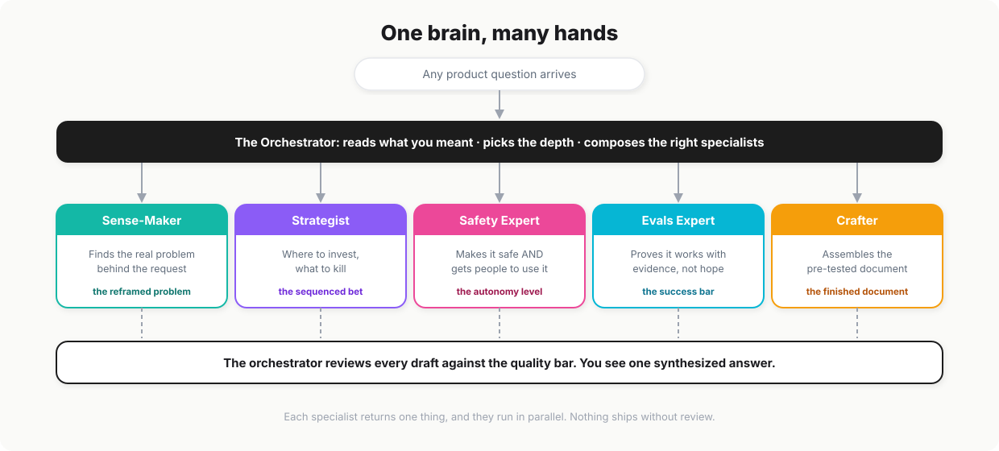
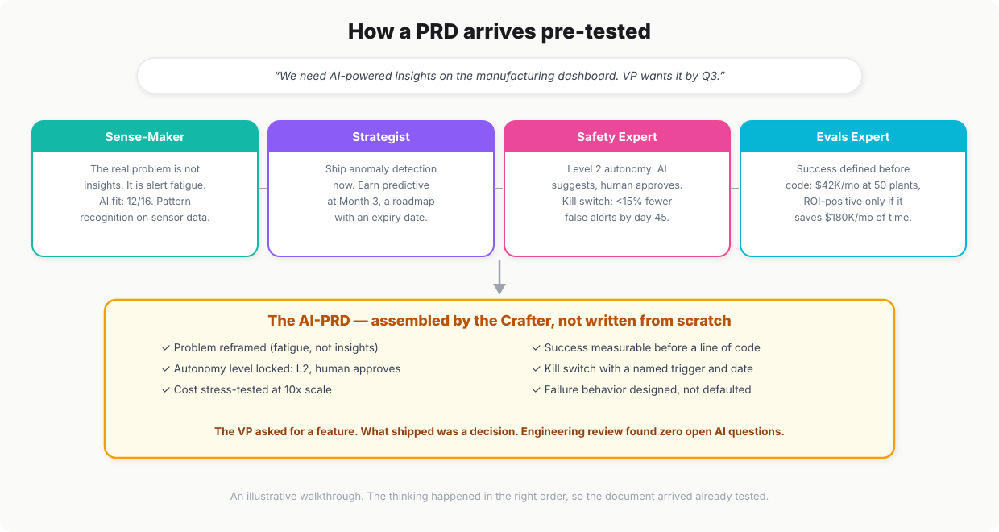
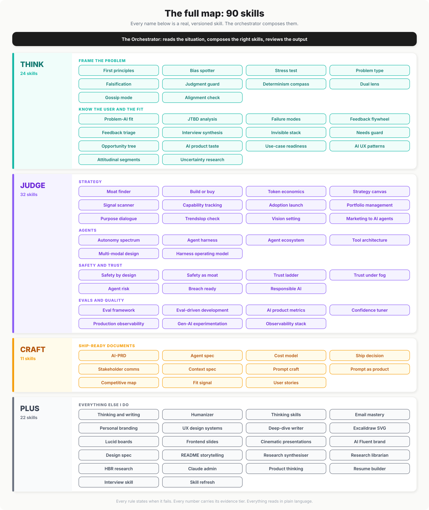

  

# rtp-personal-skills

This is my product judgment, written down and version-controlled.

Most PMs carry their thinking in their head, and it leaves when they do. I spent three years externalizing mine: **86 skills** that encode how I make AI product decisions — when AI is the right answer and when rules are cheaper, how much autonomy an agent has earned, what a real moat is, what to check before anything ships. An **orchestrator** composes them the way I would, so the system doesn't just store my judgment — it applies it.

## What's inside

| | | |
|---|---|---|
| **Think** | 24 skills | Is this even an AI problem? What bias makes it feel obvious? What's the user really hiring it for? |
| **Judge** | 29 skills | Autonomy, moats, pricing, safety, evals — the calls that earn the right to ship. |
| **Craft** | 10 skills | AI-PRDs, agent specs, cost models, launch gates — documents that arrive pre-tested. |
| **Plus** | 18 skills | The orchestrator, writing, presentations, design systems, research, admin. |

11 commands chain skills into one decision. 6 templates run multi-step work in realistic sittings. Full detail: [ARCHITECTURE.md](ARCHITECTURE.md).

## How it works

The orchestrator spawns specialist workers, runs them in parallel, and reviews everything before you see one answer:

  

Here's what that produces — one real request, end to end:

  

## Why it works

- **Every rule states the conditions under which it fails.** Advice that doesn't know its limits is more dangerous than no advice — so nothing in here ships without its failure condition.
- **Every number is tagged by how solid it is** — ✅ audited · ◆ company-disclosed · ⚠ reported. A forecast is never called a fact.
- **Everything reads in plain language.** If a framework term appears, a legend explains it. A system only compounds if the next reader — human or AI — understands it on first pass.

## Who built it

**Ravi Teja Palanki** — Senior Technical PM at Honeywell · Perplexity AI Fellow 2025. 12+ years shipping enterprise products at Fortune 100 scale; now shipping Gen AI into production for safety-critical industrial environments, where a hallucination isn't an inconvenience — it's a compliance incident.

[ravitejapalanki.com](https://ravitejapalanki.com) · [LinkedIn](https://www.linkedin.com/in/ravipalanki) · ravi.aifluentproduct@gmail.com

## The full map

  

---

This is my personal operating system — public so the work is visible, not packaged for reuse. All Rights Reserved. · July 2026
