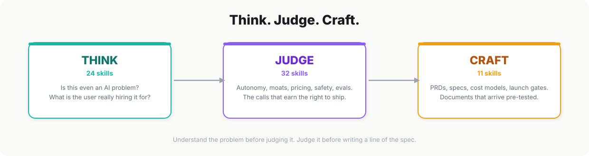
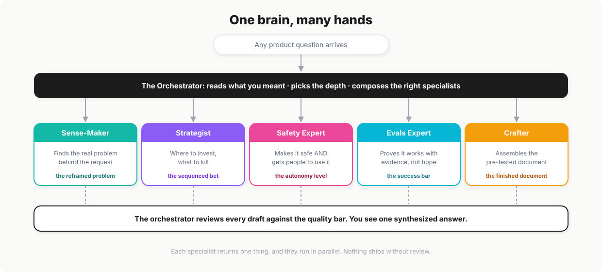
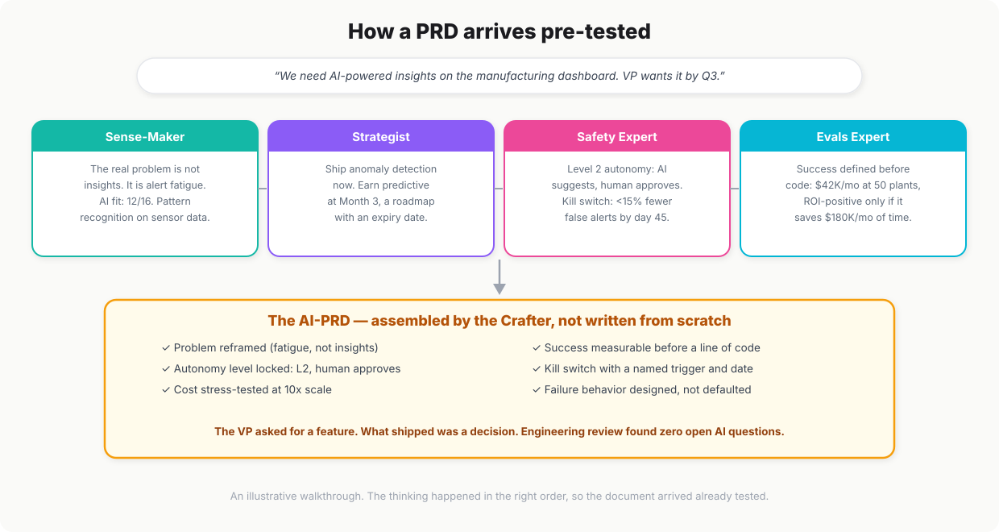
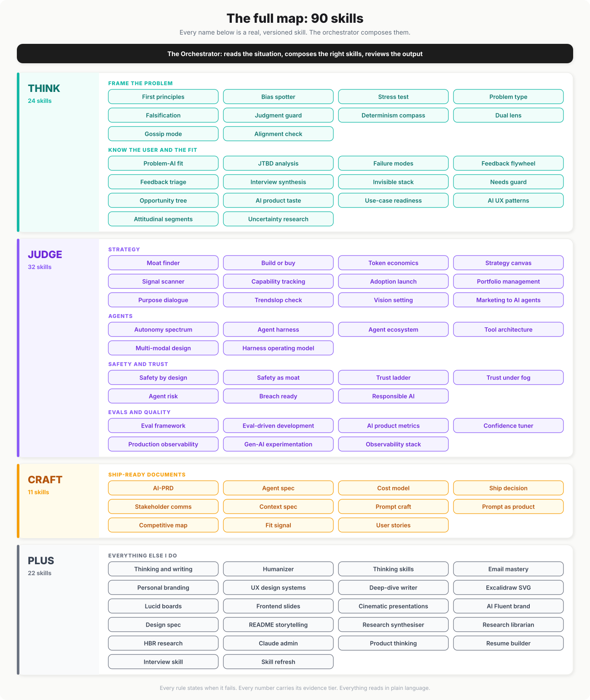

  

# rtp-personal-skills

This is my product judgment, written down and version-controlled.

Most PMs carry their thinking in their head, and it leaves when they do. I spent three years externalizing mine: **90 distinct skills** that encode how I make AI product decisions. When AI is the right answer and when rules are cheaper. How much autonomy an agent has earned. What a real moat is. What to check before anything ships. An **orchestrator** composes them the way I would, so the system does not just store my judgment. It applies it.

## Current release

**v2.7.9** is the release on `main`. Commit [`d6d71dc`](https://github.com/raviteja-palanki/rtp-personal-skills/commit/d6d71dc), 27 Sep 2026.

The sync copied 73 revised skills in from the source library. The plugin manifest counts **91** skill files. The map below names **90** distinct skills. The extra file is a second copy of personal branding. `skills/rtp-ravi-personal-branding/SKILL.md` is the same file as `skills/rtp-personal-branding/SKILL.md`, and both declare the name `rtp-personal-branding`. The second folder also keeps older drafts in `archive/`.

`plugin.json` is at 2.7.9. Update with the commands in [CLAUDE.md](CLAUDE.md), then restart Claude Code. Cursor installs this same repository and pins a commit. Update the plugin in Cursor, then open a new chat. A chat that is already open keeps the copy it started with.

## What's inside

| | | |
|---|---|---|
| **Think** | 24 skills | Is this even an AI problem? What bias makes it feel obvious? What is the user really hiring it for? |
| **Judge** | 32 skills | Autonomy, moats, pricing, safety, evals. The calls that earn the right to ship. |
| **Craft** | 11 skills | AI-PRDs, agent specs, cost models, launch gates. Documents that arrive pre-tested. |
| **Plus** | 22 skills | Writing, research, design systems, presentations, admin. |
| **Orchestrator** | 1 | Reads the situation, composes the right skills, reviews the output. |

Those five rows are the 90 names on the map. The manifest's 91st file is the duplicate personal-branding folder above.

11 commands chain skills into a single decision. 6 workflows run multi-step work in one realistic sitting. 3 framework references sit behind them. Full detail: [ARCHITECTURE.md](ARCHITECTURE.md).

## How it works

The orchestrator spawns specialist workers, runs them in parallel, and reviews everything before you see one answer:

  

Here is what that produces. One request, end to end. The walkthrough is illustrative. The dollar figures in it are a constructed example, not a measured result:

  

## Why it works

- **Every rule states the conditions under which it fails.** Advice that does not know its limits is more dangerous than no advice, so nothing here ships without its failure condition.
- **Every number is tagged by how solid it is:** ✅ audited · ◆ company-disclosed · ⚠ reported. A forecast is never called a fact.
- **Everything reads in plain language.** If a framework term appears, a legend explains it. A system only compounds if the next reader, human or AI, understands it on first pass.

## Who built it

**Ravi Teja Palanki**, Senior Technical PM at Honeywell · Perplexity AI Fellow 2025. 12+ years shipping enterprise products at Fortune 100 scale, now shipping Gen AI into production for safety-critical industrial environments, where a hallucination is not an inconvenience. It is a compliance incident.

[ravitejapalanki.com](https://ravitejapalanki.com) · [LinkedIn](https://www.linkedin.com/in/ravipalanki)

## The full map

  

The map title says 90 skills. That count is the distinct set: Think 24, Judge 32, Craft 11, Plus 22, plus the orchestrator. Personal branding appears once, as "Personal branding."

---

This is my personal operating system. Public so the work is visible, not packaged for reuse. All Rights Reserved. · v2.7.9 · 27 Sep 2026
